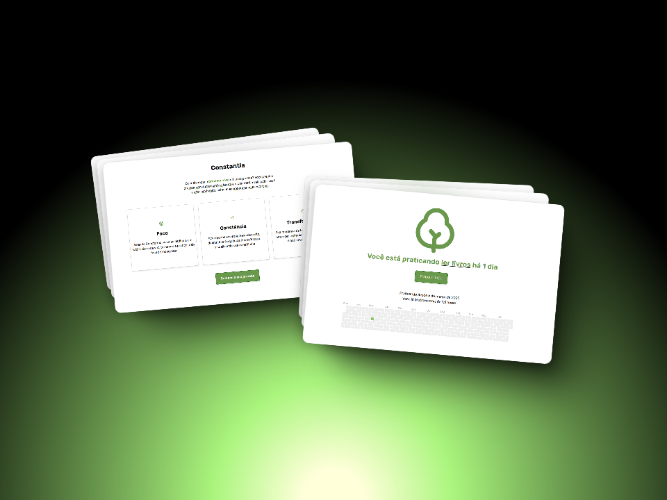
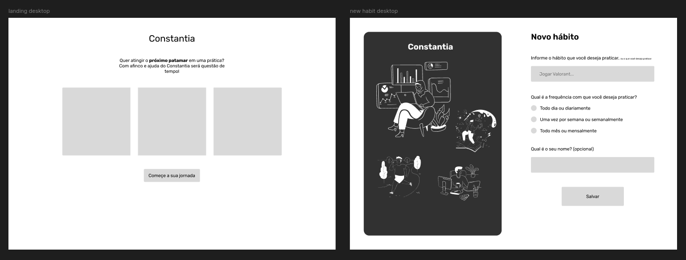
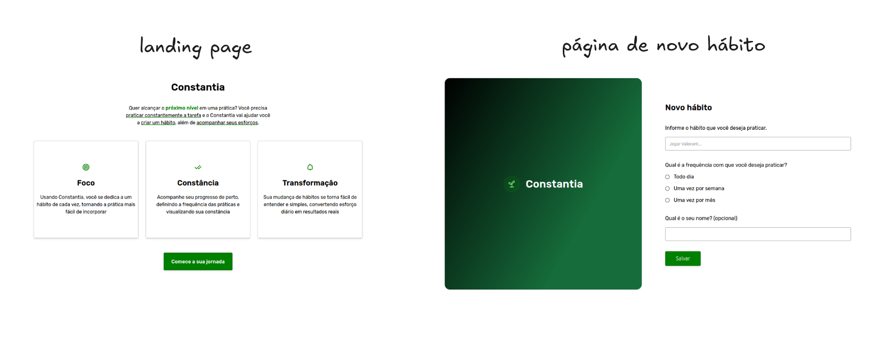
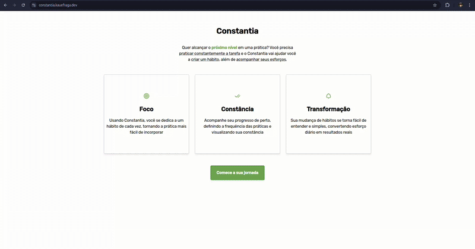

# Constantia 🌱

[](https://constantia.kauefraga.dev)
[](https://github.com/kauefraga/constantia/blob/main/LICENSE)
[](https://github.com/kauefraga/constantia)

Quer começar um novo hábito? O Constantia vai ajudar você a alcançar seu objetivo enquanto você acompanha seus esforços.

Um sistema web projetado para ser

- Fácil de usar e visualmente confortável
- Responsivo - se adapta a diferentes telas
- Um ajudante na sua jornada

<div align='center'>

[](https://constantia.kauefraga/dev/)

</div>

## Estrutura do projeto e escolhas técnicas

Dentro do diretório [`src`](src/) é possível ver a seguinte estrutura:

```sh
├─ components/  # componentes
├─ pages/       # páginas
├─ stores/      # entidades e localStorage
├─ utils/       # utilitários
├─ main.css     # estilos globais
├─ main.tsx     # ponto de entrada, roteamento e fontes
```

As principais tecnologias usadas para desenvolver este sistema foram:

- TypeScript
- Bun
- React
- React Router
- Zustand
- Styled Components
- CloudFlare Pages

## Como rodar em ambiente de desenvolvimento

Verifique se você tem o runtime [Bun](https://bun.sh/) instalado na sua máquina.

Também é possível executar o projeto com Node e NPM (ou derivados).

Clone o projeto na sua máquina (faça um fork primeiro se você planeja contribuir)

```sh
git clone https://github.com/kauefraga/constantia.git

cd constantia
```

Instale as dependências do projeto

```sh
bun install
```

Inicie o servidor do Vite

```sh
bun dev
```

Acesse [localhost:5173](http://localhost:5173/) e pronto!

## Detalhes do projeto

Eu queria registar minha evolução em um jogo competitivo de FPS tático e criar o hábito de treinar todo dia. Para isso, pensei em fazer um risco em um caderno a cada treino realizado, mas logo percebi que essa abordagem era rudimentar e limitada.

Eu precisaria ter o caderno e uma caneta sempre que fosse treinar, precisaria contar cada risco e calcular sempre que quisesse saber quantos dias pratiquei e essa seria a única métrica que eu teria.

O Constantia surgiu para facilitar e adicionar uma experiência leve e recompensadora nesse processo.

A palavra "constantia" vem do latim e significa constância. Escolhi essa palavra porque acredito que ter constância **traz resultados**.

<details>
  <summary>Primeiro design do projeto</summary>

<br />

Versão desktop da landing page e formulário de hábito, feito no Figma.



</details>

<details>
  <summary>Implementação do primeiro design</summary>

<br />



[](https://constantia.kauefraga/dev/)

</details>

## Contribuições

Fique à vontade para contribuir [abrindo uma issue](https://github.com/kauefraga/themis/issues/new) para reportar um bug, sugerir uma alteração na interface, uma melhoria ou uma nova funcionalidade.

### Como contribuir

1. Faça um *fork* do projeto
2. Clone seu *fork* na sua máquina
3. Prepare o [ambiente de desenvolvimento](#como-rodar-em-ambiente-de-desenvolvimento)
4. Faça as alterações e *commit* elas com [mensagens descritivas](https://github.com/kauefraga/constantia/commits/main/)
5. Sincronize as alterações com o repositório do seu *fork* (`git push`)
6. Abra um *pull request* especificando o que você fez de forma geral (considerando que as alterações têm seus *commits* descritivos)

### Contribuidores e apoiadores

Meus agradecimentos a essas pessoas incríveis que ajudaram a aprimorar o projeto ou incentivaram a continuação do projeto por meio de doações:

<a href="https://github.com/tomast1337"></a>

## Licença

Este projeto está sob a licença MIT - Veja a [LICENÇA](LICENSE) para mais informações.

---

Obrigado por usar o Constantia! Caso tenha ajudado você, considere dar uma estrela no repositório e compartilhar com pessoas que possam gostar também ⭐

É um projeto open source e vai continuar sendo, fazendo [uma doação para eu tomar um cafézinho](https://pixmeacoffee.vercel.app/kauefraga) você me incentiva a mantê-lo atualizado, além de me deixar muito feliz 💚
